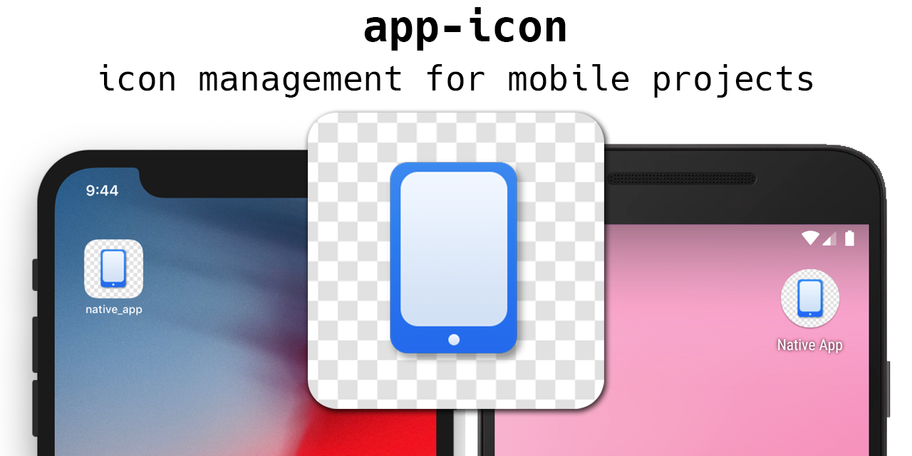

# app-version

[](https://badge.fury.io/js/app-version) [](https://circleci.com/gh/dwmkerr/app-version) [](https://ci.appveyor.com/project/dwmkerr/app-version) [](https://codecov.io/gh/dwmkerr/app-version) [](https://david-dm.org/dwmkerr/app-version) [](https://david-dm.org/dwmkerr/app-version?type=dev) [](https://dashboard.guardrails.io/default/gh/dwmkerr/app-version) [](https://greenkeeper.io/) [](https://conventionalcommits.org)

Version management for mobile apps. Allows version numbers to be controlled for Native, React Native, Corvoda, Xamarin and more. Ideal for CI/CD.



<!-- vim-markdown-toc GFM -->

* [Introduction](#introduction)
* [Installation](#installation)
* [Usage](#usage)
    * [Set Version](#set-version)
* [Developer Guide](#developer-guide)
    * [Initial Setup](#initial-setup)
    * [Running Tests](#running-tests)
    * [Debugging](#debugging)
    * [Commit Messages](#commit-messages)
    * [Creating a Release](#creating-a-release)
    * [Builds](#builds)
    * [Debugging](#debugging-1)

<!-- vim-markdown-toc -->

## Introduction

This simple tool allows you to set the version for an app consistently across multiple projects. It is ideal for CI/CD and build scenarios.

As an example, the script below sets the version for an iOS and Android app in a React Native project to the version specified in the `package.json` file:

```bash
npx app-version set-version $(cat package.json | jq .version -r)
```

You can also use the module directly in node:

```js
import appVersion from 'app-version';

await appVersion.setVersion({ version: '0.1.2' });l
```

## Installation

Install with:

```bash
npm install -g app-version
```

## Usage

Here's a quick reference:

### Set Version

To set the application version, run:

```sh
app-version set-version 0.1.2
```

**iOS**

Updates the `Info.plist` file:

```
	<key>CFBundleShortVersionString</key>
	<string>0.1.2</string>
```

**Android**

Updates the `app/build.gradle` file:

```
android {
    defaultConfig {
        versionName "0.1.2"
    }
}
```


## Developer Guide

The only dependencies are Node LTS (or above).

Useful commands for development are:

| Command              | Usage                                                                                    |
|----------------------|------------------------------------------------------------------------------------------|
| `npm test`           | Runs the unit tests.                                                                     |
| `npm run debug`      | Run a command in a debugger, e.g. `npm run debug show-versions`.                         |
| `npm run test:debug` | Runs the tests in a debugger. Combine with `.only` and `debugger` for ease of debugging. |
| `npm run cov`        | Runs the tests, writing coverage reports to `./artifacts/coverage`.                      |

Currently the linting style is based on [airbnb](https://github.com/airbnb/javascript/tree/master/packages/eslint-config-airbnb). Run `npm run lint` to lint the code.

### Initial Setup

Install the dependencies (I recommend [Node Version Manager](https://github.com/creationix/nvm)):

```bash
nvm install --lts
nvm use --lts
git clone git@github.com:dwmkerr/app-version.git
cd app-version
npm install && npm test
```

### Running Tests

Run the tests with:

```bash
npm test
```

Tests are executed with [Mocha](https://mochajs.org/) and coverage is handled by [Istanbul](https://github.com/gotwarlost/istanbul). Coverage reports are written to an `./artifacts` folder.

Note that best practices are to pass Mocha a quoted string with a glob pattern for cross-platform execution of tests (see [Mocha Docs](https://mochajs.org/#the-test-directory)). However for some reason on AppVeyor this doesn't seem to work. Leaving the pattern unquoted works for `cmd` as well as the shell in builds for now. So please be careful if changing the quotes and test on both platforms.

### Debugging

You can use the `npm run debug` command to quickly debug the code:

```sh
npm run debug show-versions
```

### Commit Messages

[Conventional Commits](https://www.conventionalcommits.org) should be used. This allows the CHANGELOG to be kept up to date automatically, and ensures that semantic versioning can be expected from the library.

### Creating a Release

To create a release.

- Merge your work to master.
- Use `npm run release`.
- Push and deploy `git push --tags && git push && npm publish`

Note that `semantic-version` is used, meaning a changelog is automatically kept up to date, and versioning is handled semantically based on the commit message.

### Builds

Builds are run on CircleCI. You can run the CircleCI build locally with the following command:

```
make circleci
```

### Debugging

The [`debug`](https://www.npmjs.com/package/debug) package is used to support low-level debugging. If you want to see debug messages when running the tool, just set the `DEBUG` environment variable to `app-version`:

```sh
DEBUG=app-version app-version set-version --platforms android
```
